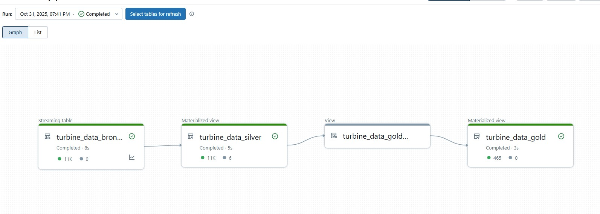
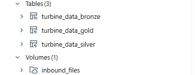
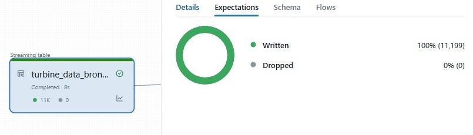
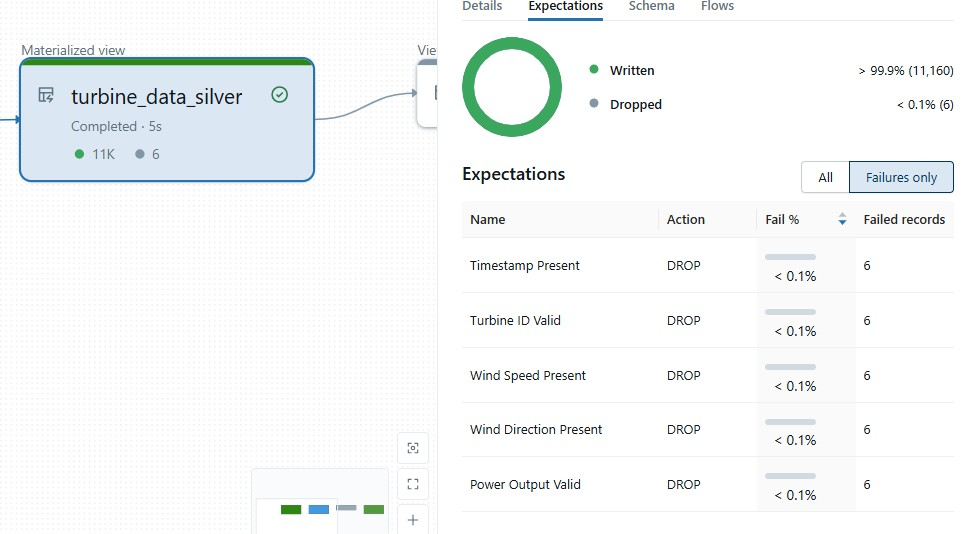
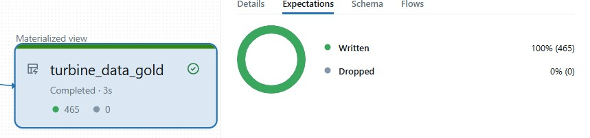

# Windturbineproject Overview

## Project Directory Structure
The Wind Turbine Project is designed using Databricks Asset Bundles to deploy all workspace resources efficiently. The project follows an ETL (Extract-Transform-Load) folder structure, encompassing the code for each layer performing its respective tasks. 

```
windturbineproject/
├── bundle/
│   ├── src/
│   │   ├── extract_data.py
│   │   ├── transform_data.py
│   │   └── load_data.py
│   ├── tests/
│   │   ├── unit_tests/
│   │   │   └── test_utils.py
│   │   ├── integration_tests/
│   │   │   └── test_orchestrator.py
│   ├── resources/
│   │   ├── schemas.yml
│   │   ├── volumes.yml
│   │   ├── turbine_data_deployment.yml
│   │   └── turbine_data_dlt_pipeline.yml
│   ├── databricks.yml
├── README.md
```

## Medallion Architecture

- **Bronze Layer**: Ingests raw files into the bronze layer using Databricks Auto Loader for seamless incremental data processing. Once the given CSV files are loaded to volumes,they were easily been processed and more can be appended in future and the pipeline processed them incrementally at scale.

- **Silver Layer**: Applies data cleansing and transformation, including:
    1. Removing duplicate rows.
    2. Automatically identifying numeric and categorical columns.
    3. Handling missing values:
         - Imputing numeric columns with their mean.
         - Filling categorical columns with 'Unknown'.
    4. Managing outliers in numeric columns using IQR capping (Winsorization).
    5. Standardizing text columns (trimming spaces and converting to lowercase).
    6. Filtering rows where integer-type fields are not null.

- **Gold Layer**: Calculates summary statistics and identifies anomalies in the data. Delta Live Tables (DLT) is used to orchestrate this process, ensuring scalability and reliability. DLT pipelines are designed to handle data of any size, leveraging serverless execution to scale resources dynamically based on workload. Additionally, DLT expectations are implemented to perform data quality checks, ensuring data integrity after cleansing and transformation.

The project is orchestrated using a DLT (Delta Live Tables) pipeline, which simplifies the workflow and ensures scalability with serverless execution. DLT's declarative approach to defining data transformations and its built-in monitoring capabilities make it an ideal choice for building robust and maintainable data pipelines.

## End-to-End DLT Pipeline Flow

The Wind Turbine Project includes an end-to-end Delta Live Tables (DLT) pipeline that orchestrates the entire ETL process. The following images provide a comprehensive view of the pipeline:

- **DLT Pipeline Flow**: Visual representation of the DLT pipeline execution.
    

- **Unity Catalog Tables**: Overview of the tables managed in Unity Catalog.
    


## Data Quality

Ensuring data quality is a critical aspect of the Wind Turbine Project. The following images illustrate the data quality checks performed at each layer of the ETL pipeline:

- **Bronze Layer**: Initial data ingestion quality checks.
    

- **Silver Layer**: Data cleansing and transformation quality checks.
    

- **Gold Layer**: Final data quality checks and anomaly detection.
    

These visualizations provide insights into the data quality at each stage, ensuring that the pipeline maintains high standards of data integrity and reliability.

## Utilities and Testing

- **Utils**: Contains all the cleansing and transformation logic, making the code modular and reusable.
- **Unit Tests**: Validate each individual component of the Utils module. Located in the `tests/unit_tests` directory, they ensure that the cleansing and transformation logic in the `Utils` module works as expected.
- **Integration Tests**: Test the orchestrator file by mocking functions to ensure end-to-end functionality. Located in the `tests/integration_test` directory, the orchestrator file is tested by mocking dependencies to simulate the entire workflow, ensuring seamless integration between components.

By incorporating both unit and integration tests, the project ensures high code quality and robust functionality across all layers of the pipeline.

## Key Features

- **Auto Loader**: Enables smooth processing of incremental data, automatically detecting new files and ingesting them with minimal configuration. This ensures the pipeline can handle continuous data streams without manual intervention.
- **DLT Pipelines**: Simplify the ETL process and ensure scalability with serverless clusters. DLT's ability to dynamically allocate resources ensures that the solution can process data efficiently, regardless of its size.
- **Unity Catalog**: Ensures secure and managed table storage, providing fine-grained access control and governance.

## Assumptions

- The project is designed to work in both development and production workspaces.
- Requires Unity Catalog for table management.
- Uses serverless clusters to run the DLT pipeline.
- Tubine Data CSV Files are uploaded to a Databricks Volume.
- Tables are managed within Unity Catalog.

This project structure and workflow ensure a robust, scalable, and maintainable data pipeline for processing wind turbine data. By leveraging Auto Loader for efficient data ingestion and DLT for scalable and reliable data processing, the solution is designed to handle data of any size while maintaining data quality and integrity.

## Installation and Setup

### Prerequisites
Before starting, ensure you have the following installed:
- [Visual Studio Code (VS Code)](https://code.visualstudio.com/): A lightweight and powerful code editor.
- [Python](https://www.python.org/downloads/): Required for running the Databricks CLI.

### Step 1: Install and Configure VS Code
1. Download and install [VS Code](https://code.visualstudio.com/).
2. Install the Python extension for VS Code from the Extensions Marketplace.
3. Set up a Python virtual environment:
    ```bash
    python -m venv .venv
    source .venv/bin/activate  # On Windows, use .venv\Scripts\activate
    ```
4. Install required Python packages:
    ```bash
    pip install -r requirements.txt
    ```

### Step 2: Install and Configure the Databricks CLI
1. Install the Databricks CLI:
    ```bash
    pip install databricks-cli
    ```
2. Configure the Databricks CLI by running:
    ```bash
    databricks configure --profile <profile-name>
    ```
    Follow the prompts to enter your Databricks host URL and personal access token. 
    For detailed instructions, refer to the [Databricks CLI documentation](https://docs.databricks.com/dev-tools/cli/index.html).

### Step 3: Deploy Using Databricks Asset Bundles
1. Install the Databricks Asset Bundles package:
    ```bash
    pip install databricks-bundle
    ```
2. Validate the bundle configuration:
    ```bash
    databricks-bundle validate
    ```
3. Deploy the bundle to your Databricks workspace:
    ```bash
    databricks-bundle deploy
    ```
4. Monitor the deployment logs to ensure successful deployment.

By following these steps, you can set up your development environment, configure the Databricks CLI, and deploy the Wind Turbine Project using Databricks Asset Bundles.
